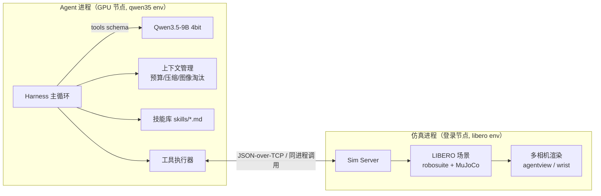

# arm_agent — VLM 工具调用驱动机械臂（LIBERO 仿真）设计文档 v0.1

状态：草案（待评审） | 日期：2026-10-07

---

## 0. 目标与边界

**一句话**：让 Qwen3.5-9B（多模态、4bit）通过结构化工具调用，自主完成 LIBERO 测试套件的简单操作任务（pick-and-place），并通过上下文压缩与技能自迭代支撑长任务稳定运行。

| 角色 | 提供方 | 状态 |
|---|---|---|
| 大脑（LLM） | `qwen35_demo` 已验证的 4bit 推理栈（GPU 节点） | 已就绪 |
| 具身平台（仿真） | LIBERO 官方套件（robosuite 1.4.0 + MuJoCo） | 待安装（本仓库） |
| Agent 框架 | 本仓库（参考 nanobot 简化） | 待开发 |
| 参考项目 | `nanobot`（agent 循环/压缩/技能）、`a3_dual_arm_sim`（工程组织/软渲染方案） | 已归档分析 |

**非目标（第一阶段）**：不做 VLA 训练/微调；不做真机迁移；不追求 LIBERO 全部 130 任务，先在 1 个简单任务上打通「感知→决策→控制→验证」闭环，再扩到 10 任务评估。

---

## 1. 系统全景



**分工原则**：
- **仿真进程** = 完整机器人 API（reset / 语义动作 / 渲染 / 状态 / 成功判据），动作到 OSC 的翻译在这里做。
- **Agent 进程** = LLM + 工具 schema + 循环逻辑 + 上下文压缩 + 技能存储。
- 两侧通过**进程边界**隔离（顺带解决「MuJoCo 只能在登录节点跑、LLM 只能在 GPU 节点跑」的节点分裂问题，见 §3）。

---

## 2. 四个关键决策

### 2.1 环境：新建 `libero` env，不动现有环境

| env | 用途 | 关键 pin | 动作 |
|---|---|---|---|
| `libero`（新） | 仿真服务：robosuite + MuJoCo + bddl | `robosuite==1.4.0`（其依赖 `mujoco>=2.3.0` 无上限，优先原配 **2.3.7**，失败再试 3.1.3/3.3.7） | **新建**（python 3.9，uv + 阿里镜像） |
| `qwen35`（已有） | LLM 推理 + harness 运行 | transformers 5.12.1 / torch 2.8 / numpy 1.26.4 | 复用，仅加轻量依赖（pyyaml 等） |
| `a3_sim` | 不动 | mujoco==3.3.7 是抓取实验的论文级 pin | **禁止改动** |
| `gl_sw`（已有） | 登录节点软件 EGL（mesalib） | — | 复用（a3 已验证该方案） |

理由：
1. LIBERO 需要 robosuite 1.4.0（2022-12，配 mujoco 2.3.x 时代），与 a3_sim 的 mujoco 3.3.7 是不同世代；混装会重演「mujoco 版本悄悄改变物理行为」的教训（a3 文档原话：pin `mujoco>=3.3.7,<3.4` 是 on purpose）。
2. 仿真不需要 torch —— LIBERO 的 env 部分是纯 numpy + MuJoCo，**不装训练栈**（robomimic/transformers/hydra 全部跳过，只装 `robosuite + mujoco + bddl + easydict`，py3.9）。
3. 渲染复用 `gl_sw`（`MUJOCO_GL=egl` + `LD_LIBRARY_PATH=gl_sw/lib`），这是 a3 在登录节点验证过的软渲染路径。
4. **不需要下载 LIBERO 演示数据集**（那是训练用，数 GB～数十 GB，且 HF 在本机不可达）；只需仓库自带的 `init_files`（每个任务 50 个初始状态，随包分发）。

### 2.2 仓库架构（本仓库 = 新 git 仓库 `arm_agent/`）

```
arm_agent/
├── DESIGN.md                  # 本文档
├── README.md
├── pyproject.toml
├── configs/
│   ├── default.yaml           # 模型路径/量化/压缩阈值/工具开关
│   └── tasks.yaml             # 场景与任务清单（suite/task_id/episode 预算）
├── src/arm_agent/
│   ├── sim/                   # ── 仿真适配层（libero env 运行）
│   │   ├── libero_env.py      #   场景加载/reset/step/obs/success 封装
│   │   ├── action_adapter.py  #   语义动作 → OSC delta 序列（含坐标系换算）
│   │   ├── frames.py          #   world/EEF 坐标与姿态转换
│   │   ├── server.py          #   Sim Server（JSON-over-TCP）
│   │   └── client.py          #   薄客户端（Agent 侧）
│   ├── tools/                 # ── 工具层（schema + 执行器）
│   │   ├── base.py            #   Tool 协议、JSON schema 生成、结果截断
│   │   ├── observe.py         #   look / get_state
│   │   ├── motion.py          #   move / rotate / gripper
│   │   ├── task.py            #   declare_done
│   │   └── memory.py          #   write_skill / read_skill
│   ├── agent/                 # ── harness（qwen35 env 运行）
│   │   ├── harness.py         #   主循环：观察→think→act→回灌→验证
│   │   ├── llm.py             #   Qwen3.5 4bit 封装（迁移自 qwen35_demo/chat.py）
│   │   ├── context.py         #   token 预算、图像淘汰、消息卫生
│   │   ├── compact.py         #   总结式压缩（模型自总结进度/经验）
│   │   └── skills.py          #   技能库（模型可写入迭代）
│   ├── prompts/               #   system / compact / reflect 模板
│   └── cli.py                 #   run / sim-server / sim-smoke / replay
├── scripts/
│   ├── setup_sim_env.sh       # 创建 libero env（uv + 镜像）
│   └── smoke_*.py             # Phase 0 验证脚本
├── third_party/LIBERO/        # LIBERO 源码（浅克隆）+ pip install -e
├── outputs/                   # episode 日志 JSONL + 回放视频 + 技能沉淀
└── tests/
```

设计约定（借鉴 a3 的工程模式）：
- **契约模块**：sim 侧观测/动作/状态用 dataclass/常量集中定义（对照 a3 `contracts.py` 的角色），agent 侧不散落魔法字符串。
- **集中配置**：所有阈值/开关进 YAML（对照 a3 `configs/default.yaml`）。
- **CLI 单入口**：`python -m arm_agent.cli <cmd>`，与 a3 `a3-sim <cmd>` 同风格。

### 2.3 对仿真平台的对接与适配（LIBERO）

已查证的接口（LIBERO 官方 README/源码）：

```python
from libero.libero import benchmark
from libero.libero.envs import OffScreenRenderEnv

suite = benchmark.get_benchmark_dict()["libero_object"]()   # 或 libero_spatial / libero_10
task = suite.get_task(0)
env = OffScreenRenderEnv(bddl_file_name=task.bddl_file, camera_heights=256, camera_widths=256)
env.seed(0); env.reset()
env.set_init_state(suite.get_task_init_states(0)[i])        # 评测用的固定初始状态
obs, reward, done, info = env.step(action7)                 # action7 = OSC delta, [-1,1]
# 成功判据：sparse reward（完成时 +1），另有 env.check_success()
```

**已从源码 + 实测证实的关键事实**：
- 默认相机 = `["agentview", "robot0_eye_in_hand"]`（第三视角 + 手腕），默认分辨率 128（我们提高到 256）。
- `control_freq=20`（20Hz 控制频率）、`horizon=1000`、`use_object_obs=True`（**obs 里含 `object-state` GT 物体状态**，作为可选辅助工具的依据）。
- 官方 demo 惯例：每 episode 开头先执行 5 步零动作（夹爪保持打开、物理稳定后开始）。
- `env.check_success()` 可用；`env.get_sim_state()/set_init_state()` 支持状态存取（可做回放与分支实验）。
- **动作上限（实测 `load_controller_config('OSC_POSE')`）**：`output_max=[0.05,0.05,0.05, 0.5,0.5,0.5]` → **平移 ±5cm / 旋转 ±0.5rad(28.6°) 每 sim step**；`control_delta=True`、`uncouple_pos_ori=True`、`kp=150`。
- **环境坑（已写入 `scripts/simenv.sh`）**：本机 `~/.local/lib/python3.9` 的 numpy 1.26.4 会遮蔽 env 内的 1.22.4（必须 `PYTHONNOUSERSITE=1`）；uv 装包会静默升级 numpy（必须 pin）。

**适配层四项职责**：
1. **观测打包**：`obs` 中的 `agentview_image`（第三视角）、`robot0_eye_in_hand_image`（手腕）、`robot0_eef_pos/quat`、`robot0_gripper_qpos` → 组装为「图像 + 结构化文本状态」给 LLM。
2. **动作翻译**（`action_adapter.py`，本项目的"事故易发区"）：
   - 工具语义动作（world frame 的 ±x/±y/±z 平移、yaw/pitch/roll 旋转、夹爪开合）
   - → 按 robosuite OSC 的每步上限（默认 output_max 平移 0.05m / 旋转 0.5rad/step，Phase 0 从本地源码 double check）切分为 N 个 step → `env.step` 循环执行。
   - Phase 0 还需落实（读本地 robosuite 源码，**不推公式**）：旋转 delta 的表达方式（axis-angle 帧约定）与夹爪符号位（正=闭合与否）。
3. **安全与预算**：distance/angle clamp、workspace 边界、单次动作的 sim step 上限。
4. **渲染管理**：按需渲染（obs 请求时触发），分辨率 256×256；评估是否默认开 wrist 相机（图像 token 便宜，见 2.4）。

**动作空间沿革**：LIBERO 原生动作 = 7D OSC delta（`[dx,dy,dz,dax,day,daz,gripper]`，归一化 [-1,1]）。**我们不在这个层次直接暴露给 LLM**（原因见 2.4），只作为适配层的「执行指令集」。

### 2.4 模型输出 = 工具调用（语义基元），不是连续动作

**论证**（为什么不做低层连续输出）：
- LLM 逐 token 生成数字，输出 7 维浮点向量的精度/格式稳定性差；4bit 量化下更不可靠。
- 连续 delta 需要模型内部维持精确的 3D 几何推演，9B 级模型做不到可靠；一次错位十几厘米无法解释。
- 但**也不能是任务级宏动作**（`pick()`/`place()`）：那会绕过「感知-决策-控制」闭环，且依赖写死的坐标，换场景即废——失去具身智能研究的意义。

**定稿：语义基元动作（方向 + 量），world frame 表达**：

| # | 工具 | 参数 | 说明 |
|---|---|---|---|
| 1 | `look` | `camera: "agent"\|"wrist"\|"both"` | 主动取最新图像（默认动作也附带状态反馈，见下） |
| 2 | `locate` | `name: str` | **M1 必备（实测升级）**：返回 GT 物体世界坐标 + 抓取高度提示。单目像素无法给深度，首个真实 episode 因此空中闭爪 |
| 3 | `get_state` | — | 结构化文本：EEF 位置(cm)/姿态(yaw,pitch,roll)/夹爪开度/最近动作结果 |
| 4 | `move` | `direction: "+x"\|"-x"\|"+y"\|"-y"\|"+z"\|"-z"`, `distance_cm: 0.5~5` | 世界系平移；服务端闭环伺服到目标点 |
| 5 | `rotate` | `axis: "yaw"\|"pitch"\|"roll"`, `angle_deg: -90~90` | 世界系旋转 |
| 6 | `set_gripper` | `action: "open"\|"close"` | 夹爪 |
| 7 | `declare_done` | `answer_note: str` | 声明完成 → 触发 success 检查并结束 episode |
| 8 | `write_skill` | `name`, `content` | 把经验写成技能文件（自迭代） |
| 9 | `read_skill` | `name` | 读取技能详情 |

设计原则：
- **≤10 个**（当前 9 个）：每加一个工具都稀释模型的工具选择准确率；工具语义单一、参数少且离散（距离给 0.5~5cm 的连续范围但服务端 clamp，优先 1/2/5 档）。
- **闭环反馈内建**：`move/rotate/set_gripper` 执行后默认返回「实测位移 + 新位置数字 + agentview 图」，模型天然看到动作后果，不必额外 `look`。反馈数字精确到 **0.1mm（4 位小数）**——M1 实测 1mm 量化会让 2mm 容差的伺服陷入极限环。
- **world frame 优先**：场景相机固定、物体在桌面，图中「上/下/左/右/前/后」与世界系一致性最高；EEF 相对动作留给 Phase 2 视需要扩展（`move_relative(dir)`）。
- 图像 token 测算（qwen35_demo 实测）：256² 图 ≈ 64 视觉 token/张（processor 输出 81 tokens 含文本）；**但显存是硬约束**——M1 实测把输入图降到 160px 长边（视觉塔激活 ∝ 像素数）。
- **工具调用输出格式（已实测模板渲染 + 真实生成）**：Qwen3.5 用 **XML 风格**而非 JSON——
  `<tool_call><function=move><parameter=direction>+x</parameter><parameter=distance_cm>2</parameter></function></tool_call>`；
  解析用正则（`<function=(\w+)>` + `<parameter=(\w+)>(.*?)</parameter>`），比 JSON 宽容（多行值、无转义问题）；模板自带格式说明段，无需在 system prompt 里重复。
- **E5 实测出的 3 个 harness 必修项**（都会造成"看起来能跑但行为错乱"）：
  1. **必须显式传 `eos_token_id=tokenizer.eos_token_id`**：checkpoint 的 generation_config 用 248044，而真实回合终止符是 `<|im_end|>`=248046。不传则生成**越过回合**继续幻觉出 `user`/后续轮次内容（首轮实测：一个回复里输出 2 轮对话，把后续输入污染）。`qwen35_demo/chat.py` 早有此修复，新 harness 必须继承。
  2. **解析后截断到第一个 `</tool_call>`**：防御性措施，防止越界生成的余量进入"assistant 消息"回灌历史。
  3. **每轮只允许恰好 1 个工具调用**（harness 层强制 + prompt 声明），防止多动作无序执行。
- **E5 语义观察（诚实记录）**：同一场景下模型两次方向选择与自身意图/GT 矛盾（说"接近罐子"但 +y 走远；说"向下"但输出 +z）。⇒ **不能假设模型的方向语义可靠**；harness 必须靠「动作后回灌真实状态数字 + 允许改向」形成闭环纠错；`locate`（GT 物体坐标）工具在 M1 就可能需要（E6 会给出量化依据）。
- **M1 实测（首个真实 episode 16 次调用）**：动作执行链完全可靠（每次 move 的 Δ 与请求一致到 mm 级），**但模型在 z=0.20 空中闭爪**——单目像素给不出深度。⇒ **`locate` 工具从"可选"升级为 M1 必备**，已实现（返回 GT 物体坐标 + 抓取高度公式）；system prompt 相应改写为"先 locate 拿坐标，再算差值逐步靠近"。视觉-only 对照实验 = `--no-images` 开关。
- 可选辅助工具（Phase 2 开关）：`locate(物体名)` 返回 GT 位置（robosuite 的 object-state）——类似「雷达」，先用图像+试探闭环，测过基线后再决定是否启用。

### 2.5 上下文压缩 + 技能自迭代

**上下文预算测算**（已确认的模型事实）：
- Qwen3.5-9B：`max_position_embeddings = 262144`（256k）；32 层中仅 **8 层全注意力**（每 4 层 1 层），24 层线性注意力（状态定长，不随序列增长）。
- KV cache 估算（fp16，4 KV heads × head_dim 256）：全注意力层 ≈ 32KB/token → **32k tokens ≈ 1GB / 64k ≈ 2GB / 128k ≈ 4GB**；4bit 权重约 5.2GB，11.24GB 显存下 **32k~48k 上下文预算从容**。
- 结论：压缩不是「能不能跑」的问题，而是「长任务后期注意力质量下降」的治理手段——软/硬阈值可以设得宽松（例如 24k/40k），首期目标是**让 30~80 次工具调用的任务在单窗口内稳定完成**，压缩负责更长的多阶段任务。

**两级压缩**（触发阈值入 `configs/default.yaml`）：
1. **软压缩（预算 ~60%）**：图像淘汰——把超过 N 轮的旧图像消息替换为一行文本占位（`[图已被省略: agentview@step12, 当时机械臂接近碗]`）。保留最近 3~5 帧原图。文本历史不动。
2. **硬压缩（预算 ~85%）**：**模型自总结**——用一段 summarize prompt 让模型产出结构化总结：
   - 任务目标、已完成的子目标、失败尝试及原因、当前世界状态、下一步计划；
   - 用「总结 + 最近 K 轮原始消息（保留最新图像）」重建历史，system prompt 与技能索引保留。
   - 借鉴 nanobot `autocompact`（其触发是 idle TTL，我们改 token 压力）与 `context_governance._compact_request_history` 的分工。

**消息卫生（多轮 tool-call 的必需健壮性）**：模型可能产出畸形 tool call、tool 结果孤儿/缺失。参考 nanobot `context_governance.py` 的四件套做简化版：`normalize_tool_result / strip_malformed_tool_calls / drop_orphan_tool_results / backfill_missing_tool_results`，外加**工具结果截断预算**（单个结果不得超过 X tokens）。

**技能自迭代**：
- 存储：`skills/*.md`（YAML frontmatter: `name/description`，正文为操作经验），参考 nanobot `skills.py` 的 SKILL.md 约定。
- 写入：任务中或 episode 结束后，模型用 `write_skill` 沉淀（如「抓取平躺物体的对位技巧」「夹爪闭合后 z 轴出现滑移的修正」）。
- 读取：启动时把技能**索引**（name+description）注入 system prompt；正文按需注入（短技能直接注入，长技能走 `read_skill`）。
- 可选「复盘阶段」（Phase 2）：episode 结束后一轮独立对话，让模型总结成败并更新技能。

---

## 3. 运行拓扑（Plan A 已实测失败 → 定 Plan B）

**背景（既有事实）**：本集群唯一可用 GPU 节点 `gpu026`（RTX 2080 Ti 11GB）是 VM，CPUID 被裁剪。**2026-10-07 实测（E3）**：CPU 只有 `ssse3`（无 SSE4.2/AVX/AVX2），Python 3.9.25 与 numpy 1.22.4 正常，但 `import mujoco`（2.3.7 wheel）**直接 SIGILL (core dumped)**——注意：**即使不渲染、只要物理也崩**（首次测试在 `import mujoco` 即崩，非渲染路径）。

**决定：采用 Plan B（双节点）**——登录节点跑仿真，GPU 节点只跑 LLM+harness。Plan A（单节点）留作未来可选项：需在 gpu026 上源码编译 MuJoCo 并关掉所有 SIMD（CMake `-mno-avx -mno-avx2`，可行性未知且维护成本高，不阻塞主线）。

**Plan B 部署（E4 已实测 → IPC 走 NFS 文件交换，不用 TCP）**：
- **网络事实（实测）**：gpu026 位于孤立子网 `192.168.82.0/23`（`192.168.82.46`，只有链路本地路由，**无默认路由**）→ 连登录节点 `172.18.34.26` 直接 `Errno 101 Network is unreachable`。**TCP 方案不可行**。
- **NFS 事实（实测）**：`/lab` NFS 在 gpu026 上**可读可写**（Qwen 模型就是从 `/lab` 加载的）；文件操作延迟极低：write+fsync **1.2ms**、stat+read **0.9ms**、rename **0.6ms**（20 次均值）。
- **IPC 协议（NFS 文件投递，带 id 编号 + 原子 rename）**：
  - 共享目录 `arm_agent/runtime/ipc/`；
  - 客户端（GPU 侧）：写 `cmd_<id>.json.tmp` → `os.rename` 成 `cmd_<id>.json`（NFS rename 原子）；
  - 服务端（登录节点）：10ms 轮询 `cmd_*.json`，执行后以同样方式发布 `resp_<id>.json`（含 state JSON + 图像文件名，图像另存 `img_<id>.png`）；
  - 双向清理已消费文件；`id` 单调递增防重放。
  - 往返延迟估算 ≈ 轮询间隔 + 2×文件延迟 ≈ **10~30ms**，与本地 TCP 同量级；对每步 233ms 的仿真和数秒级的 LLM 推理完全无感。
- agent 侧代码不变（`sim/client.py` 抽象：本地直连 or NFS 客户端），也与未来若有 TCP 通道兼容。

---

## 4. Phase 0 验证清单（按优先级，先做实验再写正式代码）

**状态：6/6 全部完成（2026-10-07）** → 结论：仿真链路可行（E1/E2）、必须双节点（E3）、IPC 走 NFS（E4）、工具协议可行且带 3 个必修项（E5）、感知层够用而决策层需闭环纠错（E6）。

| # | 实验 | 决定什么 | 环境/位置 |
|---|---|---|---|
| E1 | **✅ 已过**：`libero_object` 任务 0 完整链路——构 env 8.4s、reset 6.5s、obs **40 个键**（含 `agentview_image`/`robot0_eye_in_hand_image` 256²、`robot0_eef_pos/quat`、`robot0_gripper_qpos`、**逐物体 `*_pos` GT**、`object-state`(98)）；**步耗时 233ms**（212–264ms，含双相机）；`check_success()`、`get_sim_state()/set_init_state()` 正常；渲染图目视验证通过 | 仿真链路可行；**步预算 = 233ms/step**（规划 episode 时长用） | 登录节点 |
| E2 | **✅ 已过**：软件 EGL 渲染 256² 仅 **9ms/帧**（mujoco 2.3.7，LIBERO 场景无 a3 的阴影瓶颈）；观测到两个无害噪音（EGL init warning / mujoco 2.3.7 无 `Renderer.close()`） | 渲染预算充足，**无需** a3 的 fast-render 类优化 | 登录节点 |
| E3 | **❌ 已测**：gpu026 上 `import mujoco` 直接 SIGILL（CPU 只有 `ssse3`，无 SSE4.2/AVX）；numpy/urllib 正常，仅 mujoco 二进制崩 | **Plan A 失败** → 必须走 Plan B（双节点）；若日后要救，只能源码编译禁 SIMD | GPU 节点（srun）✅已测 |
| E4 | **❌ TCP / ✅ NFS**：gpu026 在孤立子网 `192.168.82.0/23` 无默认路由，连登录节点 `Network is unreachable`；但 `/lab` NFS 可读写，写/读/rename 延迟 1.2/0.9/0.6ms | **IPC 走 NFS 文件投递**（id 编号 + 原子 rename + 10ms 轮询，往返 ~10-30ms） | 两节点 ✅已测 |
| E5 | **✅ 已过（协议）/ ⚠️ 语义有错**：真实 4bit 生成下 3 轮全部解析出**恰好 1 个**工具调用（get_state → move +y → move +z），XML 格式稳定。**但发现 3 个必须带进 harness 的坑**（见下）+ 一个语义问题：模型两次方向判断错误（该 -y 却选 +y；嘴上说"向下"却输出 +z） | 工具协议 = XML 正则解析 ✅；**每步状态回灌是纠错主通道**；`locate` GT 工具的必要性上升到"很可能要" | GPU 节点 ✅已测 |
| E6 | **✅ 已过 4/4**（修正 GT 后）：方位（罐子/篮子相对夹爪）、夹爪开合、最近物体 全部答对。**注意此轮的最大教训**：首版题目 GT 是我"目测图像"推的（猜错了"近相机=哪边"），模型得 2/4；写相机投影探针（cam_pos/cam_mat/fovy → 像素坐标）复核后改正 GT，模型即 4/4——**是我出错题，不是模型答错** | 感知层 OK：**六方向+距离的工具粒度可行**；但 E5 的决策层方向错误说明「看得懂 ≠ 选得对」，**harness 的状态回灌/纠错闭环是关键价值点** | GPU 节点 ✅已测 |

同时核对 LIBERO 细节（读源码）：OSC `output_max`/`control_delta`、旋转 delta 参考系、gripper 符号、`check_success` 语义、obs 字段全集。

---

## 5. 风险与备选

| 风险 | 影响 | 备选 |
|---|---|---|
| gpu026 跑不了 MuJoCo（SIGILL 无法绕过） | 被迫双节点 | Plan B 已设计；再退一步 NFS 轮询 |
| 4bit 下 tool-call 格式不稳（JSON 畸形） | 循环卡死 | 降级自定义文本协议（`<action>move +x 2cm</action>`）+ 正则解析；或多采样重试 |
| LIBERO robosuite 1.4.0 在新 python/numpy 上装不上 | 环境阻塞 | python 3.8/3.9 + numpy 1.22/1.23；必要时 uv 锁版本 |
| 登录节点软渲染太慢（>1s/step） | episode 时间爆炸 | 降分辨率/砍 wrist 相机/按需渲染；最坏回到 gpu026 方案 |
| 9B 4bit 空间推理不足（分不清左右） | 任务失败率高 | 依赖闭环试探 + 状态数字反馈；Phase 2 加 `locate` GT 工具对照 |
| 上下文膨胀导致 OOM（11GB 显存紧张） | 长任务崩溃 | 两级压缩激进阈值 + KV cache 预算监控（Qwen3.5 混合注意力，全注意力层 KV 才是大头） |

---

## 6. 路线图

- **M0（Phase 0）✅ 已完成**：E1–E6 全部有结论（仿真 233ms/step、双节点 + NFS IPC、XML 工具协议 + 3 必修项、感知 4/4 vs 决策需闭环）。
- **M1（最小闭环）🔄 实现完成，验证大半**：sim server/client（NFS IPC）+ adapter（闭环伺服）+ 8 工具 + harness（含 E5 三必修项 + 每步数字回灌 + 图像淘汰）。**四条实测教训已固化**（见 §2.3 / 下）：
  1. **OSC_POSE 是每 tick 重算的 `goal = current + delta`**——开环发一次 delta 只兑现 ~12%（2.5cm 请求实测 0.3cm）。move/rotate 必须闭环伺服（每 tick 发 `target - current`）。
  2. **反馈量化**：向控制器/模型回灌坐标用 4 位小数（0.1mm）。3 位（1mm）时 2mm 容差的伺服进入极限环（读→动→读同一舍入值），永不收敛。
  3. **robosuite 必须 `ignore_done=True`**（LIBERO 官方 eval 同款）：否则 timestep≥horizon(1000) 后 `done=True`，后续 step 抛 "executing action in terminated episode"（一条贪心探针的 1000+ ticks 实测触发）。
  4. **渲染 = 单步 90%**（245ms→24ms）：adapter 内部 tick 关闭相机 observable，每次工具调用结束后 `_get_observations(force_update=True)` 刷新一次。
  - 验证证据：动作语义 10/10；IPC 往返 8/8；**dry-run（脚本策略替 LLM）完整成功** `success=True, turns=109, retries=0`，罐子在篮内（XY 距篮心 19mm），80s/集。
  - 抓取物理标定（task0/init0）：GRAB_Z=0.05（+5.3cm 提离）；0.035 推飞；下降前 XY 偏差 >4mm 会撞飞罐子；夹住时 gripper width≈0.0197 = 罐子 y 向宽 40mm。
- **M2（长任务能力）**：两级压缩（软：图像淘汰 ✅ 已实现；硬：总结式压缩待做）+ 技能自迭代（write_skill/read_skill 已实现）+ 3~5 个任务；量化对比「有/无压缩」「有/无技能」。
- **M3（评估）**：LIBERO 10 任务 × N episodes 成功率基线 + 视频；文档化复现步骤。

---

## 附录 A：nanobot 可借鉴清单（已归档源码于 `nanobot/`）

| 文件 | 借鉴点 | 简化策略 |
|---|---|---|
| `nanobot/agent/loop.py:980` `_run_agent_loop` | 多轮迭代 + tool result 回灌的循环形态 | 我们单会话单任务，去掉队列/钩子/子代理 |
| `nanobot/agent/context_governance.py` | `prepare_for_model/ensure_request_fits/request_pressure` 预算；`normalize_tool_result` 等消息卫生四件套；`apply_tool_result_budget` | 保留概念重写（~200 行级） |
| `nanobot/agent/autocompact.py` | 压缩调度（触发→总结→替换历史） | 触发条件由 idle TTL 改为 token 压力 |
| `nanobot/agent/skills.py` | SKILL.md + frontmatter + 按需加载 + `$name` 触发 | 简化为 skills 目录 + `write_skill/read_skill` 工具 |
| `nanobot/nanobot/skills/skill-creator` | 技能写作的元技能（教模型怎么写技能） | Phase 2 参考其 prompt 结构 |

## 附录 B：qwen35_demo 可迁移/修正清单

| 来源 | 迁移到 | 备注 |
|---|---|---|
| `chat.py::load_model`（4bit NF4 + device_map + max_memory） | `agent/llm.py` | 直接复用（已验证 49.8s 加载 / 7.38GiB 峰值） |
| `chat.py::build_inputs`（processor.apply_chat_template + enable_thinking） | `agent/llm.py` | **扩展 tools 参数**（模板已内置 tool_call 支持，实测 21 处引用） |
| `chat.py::generate`（repetition_penalty 等） | `agent/llm.py` | 扩展返回解析后的 tool_calls |
| `gpu_smoke_test.py` 的 sanity_check 模式 | `tests/` 探针 | 沿用「先自检探针、再信数据」纪律 |
| `setup_env.sh` | `scripts/setup_sim_env.sh` 参考 | **修正**: 显式 pin `numpy==1.26.4`（现只在 env 里手工修过） |
| `run_on_gpu.sh`（srun 封装） | `scripts/run_agent_on_gpu.sh` | 复用 srun 参数模板 |
